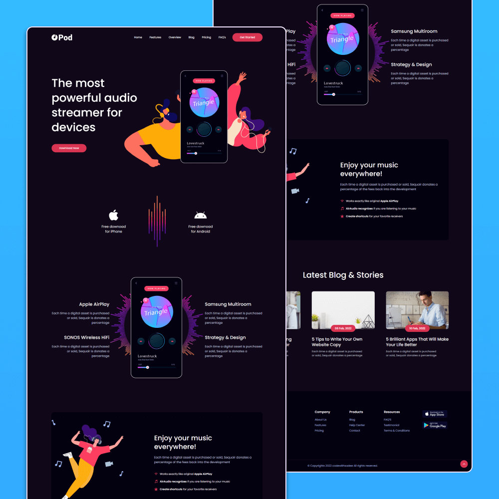

# Pod - Audio streaming app landing page

Project for practice and study in HTML, CSS and Javascript

Pod is a fully responsive audio streaming app landing page, responsive for all devices, built using HTML, CSS, and JavaScript.

## Demo

## Contact

If you want to contact me you can reach me on linkedin 